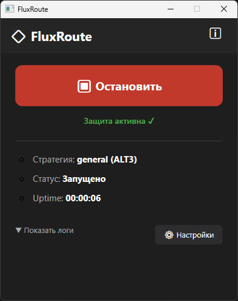
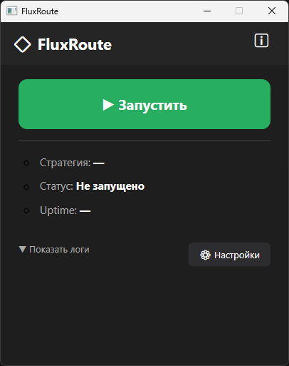
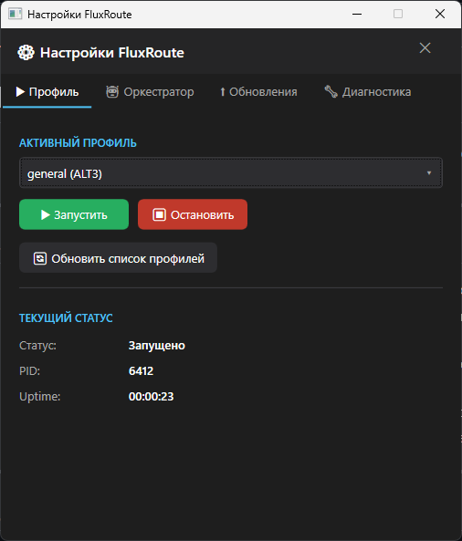
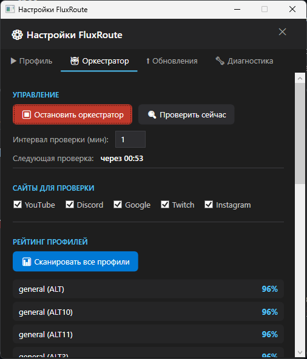
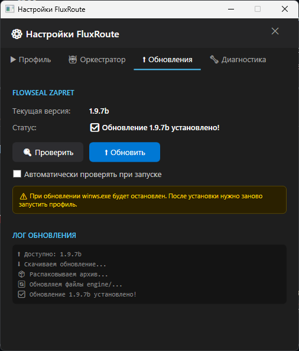

# FluxRoute Desktop

[](https://dotnet.microsoft.com/)
[](https://github.com/klondike0x/FluxRouteDev/releases)
[](https://github.com/klondike0x/FluxRouteDev/releases/latest)
[](LICENSE)

> GUI-оболочка для управления скриптами [Flowseal/zapret-discord-youtube](https://github.com/Flowseal/zapret-discord-youtube) — красиво, быстро и без ручного запуска BAT-файлов.

---

## ✨ Возможности

- **Компактный интерфейс** — одна кнопка Запуск/Стоп, статус и логи всегда на виду
- **Оркестратор** — автоматически тестирует все профили, выставляет рейтинг и переключается на лучший при сбое
- **Автообновление** — при запуске проверяет новые релизы Flowseal на GitHub и обновляет `engine/` в один клик
- **Окно настроек** — выбор профиля, управление оркестратором, сайты для проверки, диагностика
- **Скрытые окна** — BAT-файлы и `winws.exe` запускаются в фоне без лишних консолей

---

## 📸 Скриншоты

| Главное окно | Запущено |
|:---:|:---:|
|  |  |

| Профиль | Оркестратор |
|:---:|:---:|
|  |  |

| Обновления |
|:---:|
|  |

---


### Требования
- Windows 10/11 x64
- Права администратора (нужны для `winws.exe`)

### Первый запуск

1. Скачай последний релиз: [Releases](https://github.com/klondike0x/FluxRouteDev/releases)
2. Распакуй ZIP в любую папку
3. Запусти `FluxRouteDev.exe` **от имени администратора**
4. Перейди на вкладку **Обновления** → нажми **Проверить** → **Обновить**
   - Это скачает актуальную версию Flowseal zapret в папку `engine/`
5. Выбери профиль в настройках и нажми **▶ Запустить**

---

## 🤖 Оркестратор

Оркестратор — умная система автоматического управления профилями:

1. **Сканирует** все профили и проверяет доступность YouTube, Discord, Google, Twitch, Instagram
2. **Выставляет рейтинг** — каждый профиль получает оценку от 0 до 100%
3. **Автоматически переключается** на лучший профиль если текущий перестал работать
4. **Проверяет** соединение с заданным интервалом (по умолчанию каждые 20 минут)

---

## 📁 Структура проекта

```
FluxRouteDev/
├── FluxRouteDev/        — UI (WPF, Views, ViewModels)
├── FluxRoute.Core/      — Логика (Оркестратор, Проверка связи, Модели)
├── FluxRoute.Updater/   — Автообновление engine/ с GitHub
└── engine/              — Скрипты Flowseal (скачиваются автоматически)
```

---

## 🛠 Сборка из исходников

**Требования:** .NET 10 SDK, Visual Studio 2022

```bash
git clone https://github.com/klondike0x/FluxRouteDev.git
cd FluxRouteDev
dotnet build
```

---

## ⚠️ Дисклеймер

Программа является GUI-оболочкой для проекта [Flowseal/zapret-discord-youtube](https://github.com/Flowseal/zapret-discord-youtube).
Все права на `zapret` и скрипты Flowseal принадлежат их авторам.

---

## 🐛 Нашёл баг?

Если что-то работает не так — открой [Issue](https://github.com/klondike0x/FluxRouteDev/issues) и опиши:
- Что происходит
- Что ожидал увидеть
- Шаги для воспроизведения

---

## 🙏 Благодарности

Отдельное спасибо авторам проектов, которые вдохновили на создание FluxRoute Desktop:

- [**Zapret-GUI**](https://github.com/medvedeff-true/Zapret-GUI) by medvedeff-true
- [**ZapretControl**](https://github.com/Virenbar/ZapretControl) by Virenbar
- [**zapret**](https://github.com/youtubediscord/zapret) by youtubediscord
- [**zapret**](https://github.com/bol-van/zapret) by bol-van — оригинальный zapret, основа всего
- [**WinSW**](https://github.com/winsw/winsw) by winsw — запуск приложений как Windows-служб
- [**zapret-discord-youtube**](https://github.com/Flowseal/zapret-discord-youtube) by Flowseal — основа engine

---

## 📄 Лицензия

GNU General Public License v3.0 — см. [LICENSE](LICENSE)
